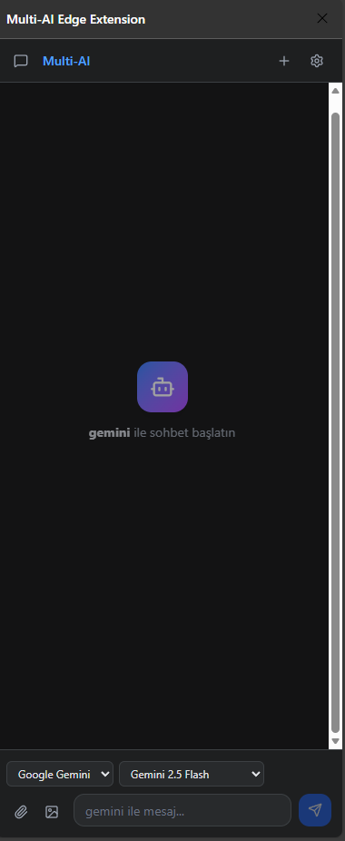

# 🚀 Multi-AI Edge Extension

**Your ultimate AI companion for the browser.** Access Google Gemini, OpenAI, Claude, Groq, and more directly from your side panel, with advanced screenshot and file analysis capabilities.


## ✨ Features

-   **🤖 Multi-Model Support**: Switch seamlessly between **Google Gemini**, **OpenAI (GPT-4o)**, **Claude 3.5**, **Groq**, **Perplexity**, **Mistral**, and **DeepSeek**.
-   **📸 Advanced Screenshotting**:
    -   **Auto-Paste**: Simply press `Print Screen` and click on the chat panel. The extension automatically detects and attaches the screenshot.
    -   **Manual Paste**: Support for `Ctrl+V` to paste images directly.
    -   **Drag & Drop**: Drag images or files directly into the chat.
-   **📄 PDF & File Analysis**: Upload PDF documents, text files, or code files. The extension automatically extracts text for AI analysis.
-   **🎨 Modern UI**: Clean, responsive design with Dark/Light mode support, built with **TailwindCSS** and **shadcn/ui**.
-   **🔒 Privacy First**: Your API keys are stored locally in your browser (`chrome.storage.local`). No data is sent to any intermediate server.



## 🛠️ Installation (Developer Mode)

Since this is a developer version, strictly follow these steps to install it in **Microsoft Edge** or **Google Chrome**.

1.  **Clone or Download** this repository.
2.  Open a terminal in the project folder and run:
    ```bash
    npm install
    npm run build
    ```
    *This will create a `dist` folder.*

3.  **Load into Browser**:
    -   Open **Edge** (`edge://extensions`) or **Chrome** (`chrome://extensions`).
    -   Enable **Developer Mode** (usually a toggle in the corner).
    -   Click **"Load unpacked"**.
    -   Select the **`dist`** folder inside this project.

## ⚙️ Configuration

1.  Open the extension side panel.
2.  Click the **Settings** (⚙️) icon in the top right.
3.  Enter your API Keys for the providers you want to use (e.g., Gemini API Key, OpenAI API Key).
    -   Keys are saved locally.
4.  (Optional) Add **Custom OpenAI-compatible providers** (e.g., local LLMs via LM Studio or Ollama).

## 🚀 Usage

-   **Chat**: Type your message and press Enter.
-   **Screenshot**: Press `Print Screen` on your keyboard, then click anywhere in the extension panel to attach it.
-   **Upload**: Click the Paperclip icon or Drag & Drop files.
-   **Switch Models**: Use the dropdown at the bottom of the chat to change AI models instantly.

## 💻 Tech Stack

-   **Frontend**: React 18, TypeScript, Vite
-   **Styling**: TailwindCSS, Shadcn/ui, Lucide React
-   **Browser API**: Chrome Extensions Manifest V3 (Side Panel, Storage, Scripting)
-   **Build Tool**: Vite (configured for CRX output)

## 🤝 Contributing

1.  Fork the repository.
2.  Create a feature branch (`git checkout -b feature/amazing-feature`).
3.  Commit your changes (`git commit -m 'Add amazing feature'`).
4.  Push to the branch (`git push origin feature/amazing-feature`).
5.  Open a Pull Request.

---

**Made with ❤️ by [Your Name]**
